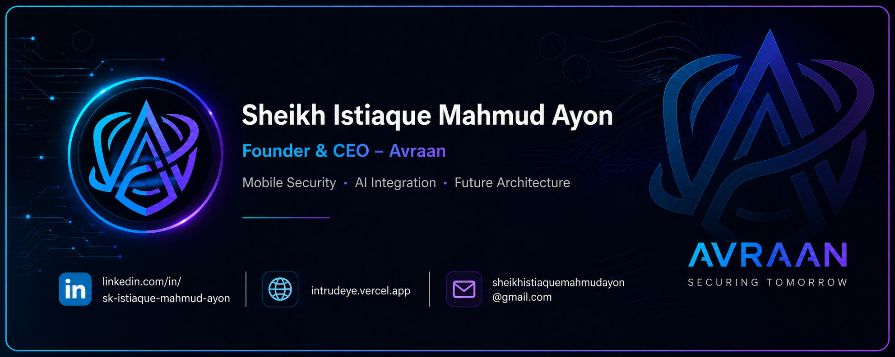
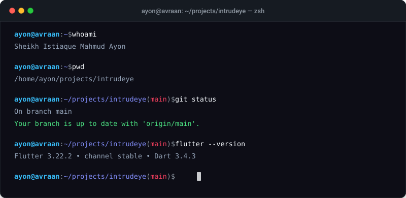

  

## Overview
Software engineer and Founder & CEO of **Avraan**, specializing in mobile security engineering, Android internals, and cross-platform architecture. Focused on developing privacy-first threat detection systems, secure runtime environments, and AI-assisted security tooling.

  

## Technical Focus
- **Languages**: Dart, Python, Kotlin, C++
- **Frameworks & Mobile**: Flutter, Android SDK, Native Platform Channels
- **Security & Systems**: Cryptographic protocols, reverse engineering mitigation, FastAPI, Docker, Linux, Git

## Selected Projects

### [IntrudEye](https://github.com/sheikhistiaquemahmudayon)
Mobile security suite for Android designed to detect unauthorized access attempts, record forensic logs, and dispatch real-time alert notifications. Built with Flutter, Kotlin native background services, and encrypted local storage.

### [Avraan Core Services](https://github.com/sheikhistiaquemahmudayon)
Security microservices and developer toolchain supporting the Avraan product ecosystem, emphasizing zero-trust architecture and low-latency client-server communication.

## Contribution Activity

  

## Contact & Links
- **Website**: [avraan.com](https://avraan.com)
- **LinkedIn**: [linkedin.com/in/sheikhistiaquemahmudayon](https://linkedin.com/in/sheikhistiaquemahmudayon)
- **Email**: [contact@avraan.com](mailto:contact@avraan.com)
- **GitHub**: [@sheikhistiaquemahmudayon](https://github.com/sheikhistiaquemahmudayon)
